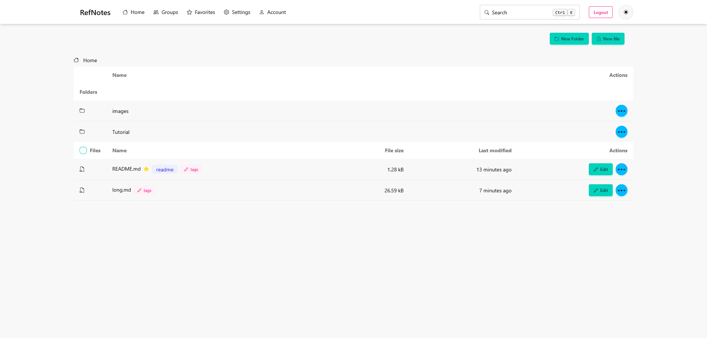
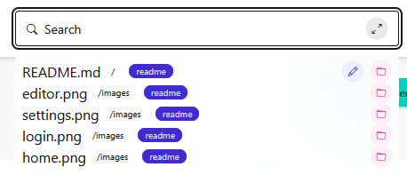
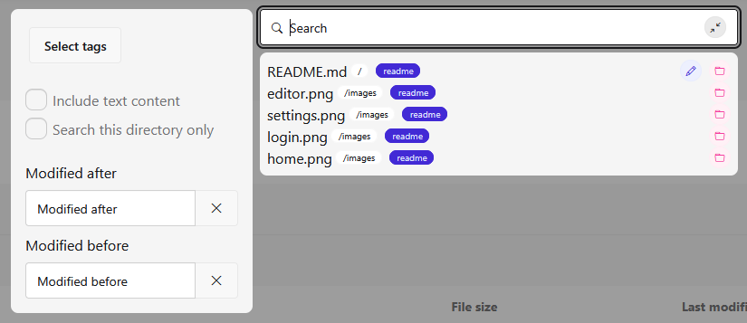
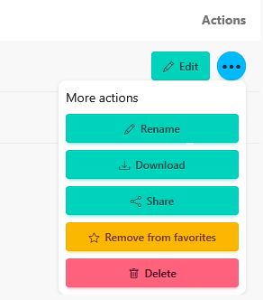
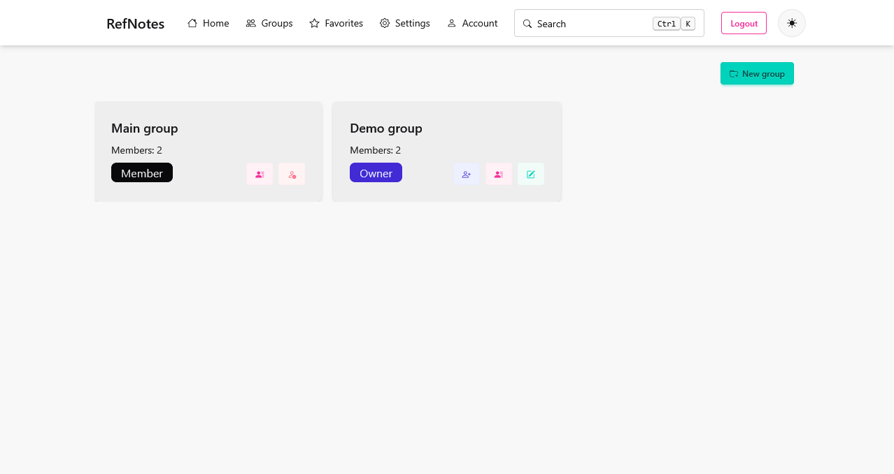
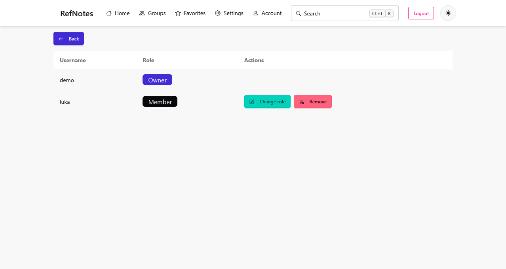
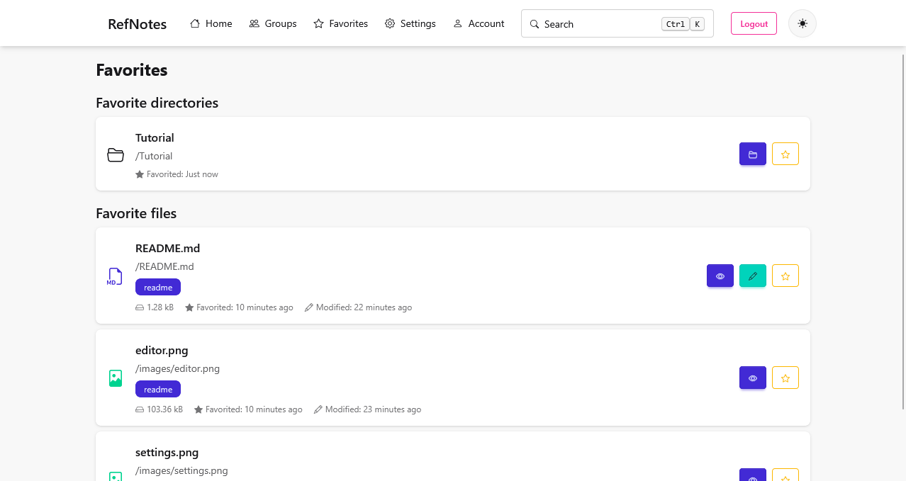
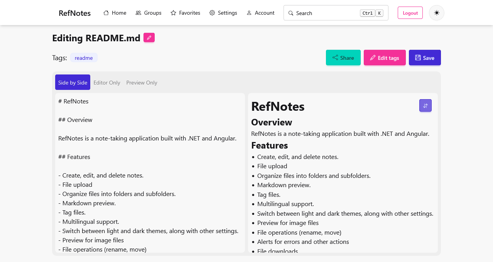

# RefNotes

## Overview

RefNotes is a note-taking application built with .NET and Angular.

## Features

- User accounts
    - With email confirmation, ability to edit account details and send password reset links
- Create, edit, and delete notes.
    - Side by side markdown editor for markdown files
    - Preview Markdown, text and image files
    - Markdown files can also display images
- Organize files into folders and subfolders.
- Tag files.
- Multilingual support.
    - English and Croatian
- Switch between light and dark themes, along with other settings.
- File operations
    - Rename, move, download
    - Upload for any type of file
- File and folder search
    - Search by name, tag, file content and by modification date
- User groups
    - Shared spaces where anyone can edit files belonging to the group
- Public notes (accessed through a public URL)
- Favorites
    - Any file or folder can be set as a favorite
    - Favorites are displayed on the Favorites page
- Live file sync
    - When a file is saved, the changes will be synced across tabs/browsers
    - This works even for public notes
- A WYSIWYG editor for markdown to simplify editing
- File sharing with other users

## Planned Features

- Autocomplete for image paths

## Getting Started

1. Clone the repository.
2. Start the backend server with `dotnet watch` inside the `Server` folder.
3. Start the frontend server with `pnpm start` inside the `Frontend` folder.

## Usage

- Start the backend and frontend servers.
- Navigate to http://localhost:4200.
- Log in and begin using the application.

## Testing

### Running Tests

- For backend tests, navigate to the `Server` folder and run:
  `dotnet test`
- For frontend tests, navigate to the `Frontend` folder and run:
  `pnpm test`

## Screenshots

### Home

#### Search - small

#### Search - big

#### More actions menu

### Login

### Groups

#### Group members

### Favorites

### Settings

### Editor

### Preview

