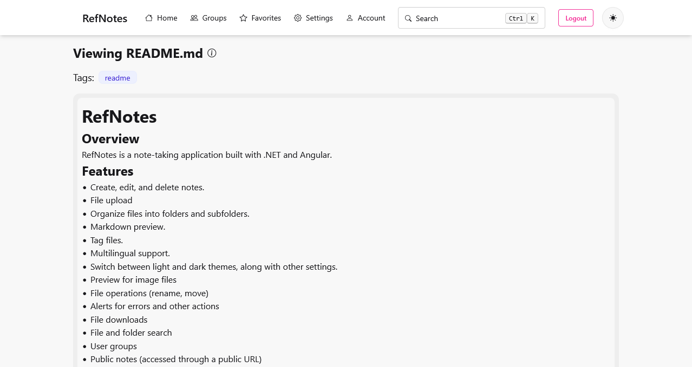

# RefNotes

## Overview

RefNotes is a note-taking application built with .NET and Angular.

## Features

- Create, edit, and delete notes.
- File upload
- Organize files into folders and subfolders.
- Markdown preview.
- Tag files.
- Multilingual support.
- Switch between light and dark themes, along with other settings.
- Preview for image files
- File operations (rename, move)
- Alerts for errors and other actions
- File downloads
- File and folder search
- User groups
- Public notes (accessed through a public URL)
- File favorites

## Planned Features

- File sharing
- Autocomplete for image paths

## Getting Started

1. Clone the repository.
2. Start the backend server with `dotnet watch` inside the `src/AppHost` folder.
3. Start the frontend server with `pnpm start` inside the `src/Web` folder.

## Usage

- Start the backend and frontend servers.
- Navigate to http://localhost:4200.
- Log in and begin using the application.

## Testing

### Running Tests

- For backend tests, run:
  `dotnet test`
- For frontend tests, navigate to the `src/Web` folder and run:
  `pnpm test`

## Screenshots

### Home

#### Search - small

#### Search - big

#### More actions menu

### Login

### Groups

#### Group members

### Favorites

### Settings

### Editor

### Preview

